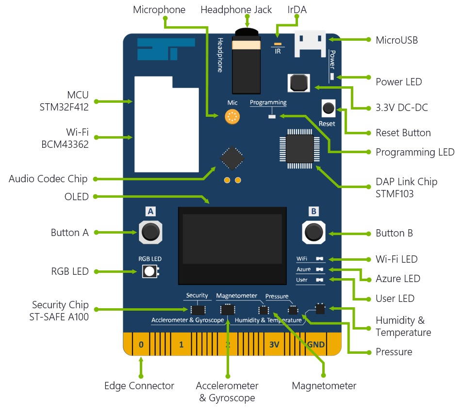

## FlySim Express Hands-On Workshop

In this hands-on workshop, you will build a comprehensive IoT solution that demonstrates some of the very best features Microsoft Azure has to offer, including [IoT Hubs](https://azure.microsoft.com/services/iot-hub/), [Event Hubs](https://azure.microsoft.com/services/event-hubs/), [Azure Functions](https://azure.microsoft.com/services/functions/), and [Stream Analytics](https://azure.microsoft.com/services/stream-analytics/).  The solution you build today will culminate into an Air-Traffic Control (ATC) app that shows simulated aircraft flying through an ATC sector and warns users when aircraft get too close to each other. While these labs are best to do with several peers, there is an application in the lab assets which can inject simulated drones into the workstream (details available in the [Labs section](#labs).)

_The Air-Traffic Control application_

You will be the pilot of one of these aircraft. And to do the flying, you will use the [MXChip IoT DevKit](http://aka.ms/devkit), which is an Arduino-compatible device that is ideal for prototyping IoT solutions. It features an array of sensors, including an accelerometer, a gyrometer, and temperature and humidity sensors, and it includes built-in Wi-Fi so it can transmit data to Azure IoT Hubs wirelessly. It also features a micro-USB port by which you can connect it to your laptop, upload software, and power the hardware.

_MXChip AZ3166 Development Board_

This lab the is "Express" version of the FlySim workshop.  It is intended for shorter duration workshops, as well as for attendees on both Windows and Mac computers.  The Express solution architecture is shown below, with elements that you will build or deploy highlighted in light blue and those deployed by the presenter highlighted in orange:

_Express Lab Solution architecture_

This lab is an "Express" version of a full-day workshop that includes a client side Universal Windows Platform (UWP) application as well as the use of Microsoft Cognitive Services.  The full lab requires access to a Windows 10 Pro computer.  If you have access to Windows 10, you can complete the full lab at [http://aka.ms/flysim](http://aka.ms/flysim)

![A data flow diagram showing IoT information originating from an Azure MXChip IoT DevKit flowing through IoT Hub and onto an Azure Function.  From the Azure Function, data is bifurcated to flow through a client application, as well as to an Event Hub shared by all workshop participants.  The shared Event Hub forwards data to Azure Stream Analytics, where it is forwarded onto another event hub for distribution to the client application.  Additionally, there are data flows from the client application to Cognitive Services.](images/architecture-full.png)

_Full Workshop Lab Solution architecture_

You will control your virtual aircraft by tilting the MXChip IoT DevKit backward and forward to go up and down, and tilting it left and right to turn. The x, y and z values  from the board's accelerometer sensor will be sent to the Azure IoT Hub in your Azure Subscription where it will trigger an Azure Function to run.  The Azure Function will take the x & y accelerometer data (we ignore the z value in this scenario) and use it to simulate the *flight data* (pitch, roll, latitude, longitude, altitude, and heading) of a virtual airplane.

The destination for that flight data is an Event Hub that is created by the Presenter and shared by you and your peers or the simulator drones.  The shared input event hub data is shown as points on a map in the Air Traffic Control (ATC) UWP app running on the Presenter's Windows 10 Computer. Events from the shared input Event Hub are also consumed by a Stream Analytics job that analyzes fast-moving data for aircraft that are in danger of colliding and provides that data to the a shared "output" event hub that is used by the ATC app. When your aircraft comes too close to another, the ATC app receives the warning from the shared output event hub and it turns the dots for the planes in danger red on the ATC app screen.

Ok, enough of the long winded descriptions.  Let's get down to it.

## Prerequisites

In order to successfully complete this workshop as an attendee, you will need:

- A Windows or Mac computer.

- An Azure IoT Developer Kit with the MXChip AZ3166 development board.  You can learn more about them and purchase one at [http://aka.ms/devkit](http://aka.ms/devkit).

- The latest firmware for the MXChip board.  We'll walk through installing that later in the labs, but you can go to "[Upgrade DevKit Firmware](https://microsoft.github.io/azure-iot-developer-kit/docs/firmware-upgrading/)" for the latest firmware for the board.

- On macOS machines, you  will need to [install Homebrew](https://docs.brew.sh/Installation.html)

- You will need the latest Azure IoT Development Kit software package.  We'll walk through this later in the lab, but you can always get the latest version from:

  - [Latest DevKit for Windows](https://aka.ms/devkit/prod/installpackage/latest)
  - [Latest DevKit for macOS](https://aka.ms/devkit/prod/installpackage/mac/latest)

- Finally, you will need to complete the "[Get Started](https://microsoft.github.io/azure-iot-developer-kit/docs/get-started/)" walkthrough for the dev board.  Again, we'll guide you through that process later.

- The Zip File with the Workshop Contents.  You can download the zip file from [https://aka.ms/FlySimExpress](https://aka.ms/FlySimExpress).

- Presenters (or you if you wish to complete the entire lab on your own outside of a workshop) will need:

    - A Windows 10 Professional or better computer
    - [Visual Studio 2017 Community Edition](https://www.visualstudio.com/vs/community/) (FREE) or better with the Windows Development Toosl feature installed.

- An WiFi network that just needs an SSID and Password (no itermediate sign in web page) with all protocols open.  Or if not all protocols need the network needs to at a minimum support inbound and outbound ports for HTTP (80), HTTPS (443), AMQP (5671,5672), and MQTT (8883).

  > **Note**: "***Why no intermediate sign in web page***" you ask?  Well because there is no way for the MXChip board to present the Web UI for you to authenticate it.  You can only give the board standard wifi login credentials (SSID/PWD(PSK)).  Yes, you may be able to connect your COMPUTER to a gated wifi connection where you have a browser to complete the login process, but you can't connect the board to one because the board has no browser, screen, keyboard, mouse, etc.

- An active Azure Subscription that you are willing to use for the resources you will create during the event.  If you delete the resources as instructed at the end of the event, the total cost for the resources shouldn't be more than a few US dolalrs.

  If you don't have an active Azure Subscription, or don't want charges billed to your existing subscription, you can create a free trial at [http://azure.com/free](http://azure.com/free). If you have created a free trial previously, you will need to create a new one using a different email address.  The recommended steps for creating a free trial for the event are:

    > **Note**: A credit card is required as part of the Free Trial sign up process.  No charges will be applied to the card, it is used just for identity verification purposes.

    1. Open a private browser session
    1. Go to http://outlook.com and create a new somename@outlook.com account
    1. Still in the same private browser session, navigate to http://azure.com/free and complete the free trial registration using your new outlook.com address, but with your real phone number and credit card for verification purposes.

## Labs

There are a few labs you need to go through to complete the workshop. They are:

- **[PRESENTER ONLY - Configure Shared Resources and ATC App](./flysimexpress-presenter.md)**

  - If you are attending the workshop, your presenter will go through this for the entire group.  You can just sit back and enjoy the ride.

  - If you will be completing the entire workshop yourself, you will need to complete this first lab yourself. You will also need a Windows 10 Professional or better workstation and Visual Studio 2017 Community Edition or better to run the Air Traffic Control Simulator (AirTrafficSim) UWP application as described in the prerequistes above.

- **[01 - Prepare the Azure IoT Development Kit Board](./flysimexpress-01.md)**

- **[02 - Deploy and Verify Your Resources to Azure](./flysimexpress-02.md)**

- **[03 - Deploy the Code to the Development Board](./flysimexpress-03.md)**

- **[04 - Fly your "Plane"](./flysimexpress-04.md)**
